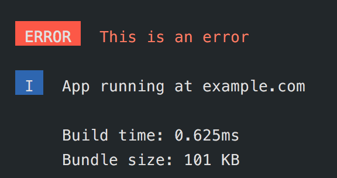

# Sweet-cli

Create beautiful cli-interfaces with ease.

## Installation

```js
npm install --save sweet-cli
```

## Usage

```js
const sweet = require('sweet-cli');

// With a custom title
sweet.error('ERROR', 'This is an error');

// Without a title
sweet.info('App running at example.com');

// Multiline messages get padded automatically
sweet.transparent('Build time: 0.625ms\nBundle size: 101 KB');
```

Output of the above code sample:



Built-in loggers:

- `success`
- `error`
- `warning`
- `info`
- `log`
- `transparent`

Other exported functions:

- `clear`: clears the console

## Special Thanks

Andrey Popp for his inspirational [tweet](https://twitter.com/andreypopp/status/758251557100064768)
and Michael Cereda for [pretty-cli](https://github.com/MichaelCereda/pretty-cli)

## License

MIT, see LICENSE.md
